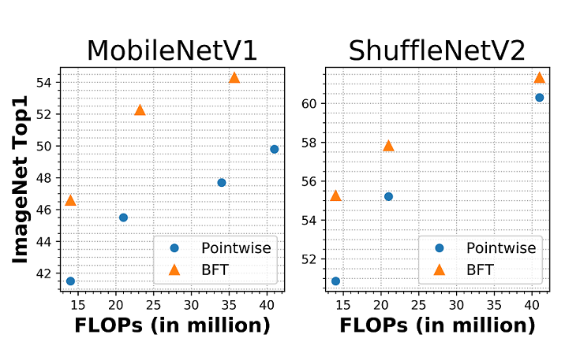

# ButterflyTransform
[1] Keivan Alizadeh vahid, Anish Prabhu, Ali Farhadi, Mohammad Rastegari. **Butterfly Transform: An Efficient FFT Based Neural Architecture Design**. to be appeared in CVPR 2020.
	
[Arxiv link](https://arxiv.org/abs/1906.02256).

## About the model

In this work we generalize butterfly operation in FFT to a general Butterfly Transform(BFT) that is beneficial in building efficient block structure for CNN designs. BFT fuses information among set of n inputs in O(n log(n)) in comparision to full matrix multiplication that does this in O(n^2).
This enabled us to use BFT as a drop-in replacement of pointwise convolution which is the bottleneck of s.o.t.a efficient architectures(MobileNet, ShuffleNet).

This is the performance of using BFT vs Pointwise convolutions on low flop regime for efficient structures.


## Usage

You can use `Fusion(method="butterfly")` in your code instead of convolutions with 1 by 1 kernels. For example replace all pointwise convolutions in MobileNet with BFT. 

This work was originally designed to reduce the bottleneck of channel fusion in pointwise convolutions but is not limited to. You can replace any dense matrix multiplication with BFT. For example for a linear layer with input size `(N,C)` reshape the input to `(N,C,1,1)` and pass it to the BFT and reshape it back to `(N,C)`. 

For a better performance we suggest to increase the number of channels while using BFT. Since the order of computation is low even with adding channels you will still have less computation with better or equal performance. Another hyperparameter which is very important is butterfly K. It determines the depth and density of BFT.


## Citation

If you found this work useful please cite us.

```
@article{alizadeh2019butterfly,
  title={Butterfly Transform: An Efficient FFT Based Neural Architecture Design},
  author={Alizadeh, Keivan and Farhadi, Ali and Rastegari, Mohammad},
  journal={arXiv preprint arXiv:1906.02256},
  year={2019}
}
```
